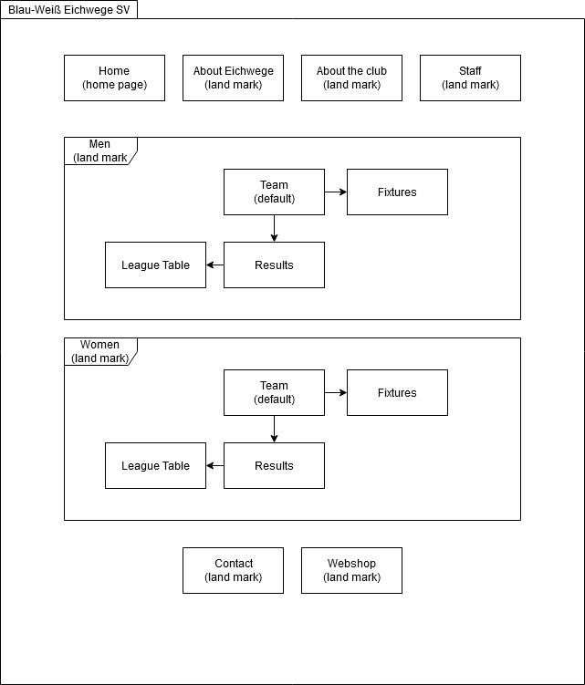
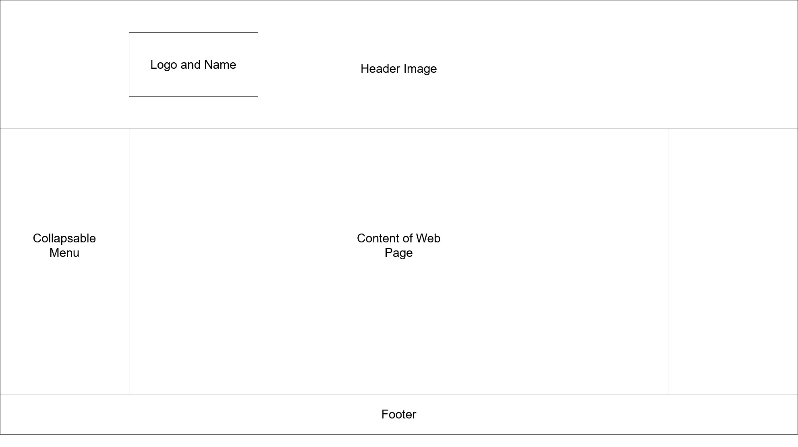

# Blau-Weiß Eichwege SV
## 1. Introduction
This website is to represent the soccer club Blau-Weiß Eichwege SV. It should show information about the teams, fixtures and some history. The name of this website is the name of the club and the domain name is 'blau-weiss-eichwege-sv.de'.

## 2. Website Design Diagram

## 3. Webpages
###  3.1 Home
#### 3.1.1 Title
Home

#### 3.1.2 Description
This is the start page. It should contain an introduction and an overview of all landmarks on this website.

#### 3.1.3 Content
Welcome to the website of the soccer club Blau-Weiß Eichwege SV. Here you can find information about the club, the teams and current fixtures as well as results from past games. We are also working on a web shop.

### 3.2 About Eichwege
### 3.2.1 Title
Eichwege

### 3.2.2 Description
The some information and history about Eichwege. NOTE: Please create a hyperlink and don't just show the URL. 

### 3.2.2 Content
Eichwege exists since 1818 and used to be an independent village. Its population grew significantly due to the industrial revolution happening in Prussia where it was part of. However, the name Eichwege was not being enforced at this time. Instead, the village was called 'Dubraucke' and most of the people were speaking Wendish, a Sorbian language. This changed in the 20th century. In 1937 the name was changed to what it is now and in 1974 it became part of Döbern.

Eichwege is located in the southeast of Brandenburg, Germany. The landscape is shaped by the so called 'Muskauer Faltenbogen'. It is heavily forested and has many lakes. Espacially the 'Eichweger Badesee' is a lake that attracts many tourists every year. The following link is a representation of some special places at Döbern, it would be great when you embed this video on the website:

https://www.youtube.com/watch?v=VsaZbs9iTEc

### 3.3 About the Club
#### 3.3.1 Title
About the Club

#### 3.3.2 Description
The some information and history about the club.

#### 3.3.2 Content
The club was unofficially founded in 1926 by a group of men passioned about soccer. They organized some games aginst other villages near by. The 'club' dissolved itself in 1931 but the passion stayed. The refoundation happened in 1952 but this time it was official. The womens team found itself in 1996. They managed to assert themself towards other teams very quickly.

While the women have played in the Kreisliga for over 13 years the raise for men happened in 2012. Since 2019 the men even play in the Kreisoberliga.  

### 3.4 Team (Men)
#### 3.4.1 Title 
Team
#### 3.4.2 Description
This page introduces the player of the team. The content of the table should be made with XML and does not represent the final design. Also add a SVG image of the national flag for each player.

#### 3.4.3 Content
| Last Name | First Name | Position | Birthday (DD-MM-YY) | Nationality | In the club since |
| ------ | ------ | ------ | ------ | ------ | ------ |
| Anderson | Will | Forward (C) | 30-10-91 | England | Summer 2014 |
| Pflüger | Roman | Midfielder | 17-03-99 | Germany | Winter 2018 |
| Hechsler | Florian | Defender | 27-01-94 | Germany | Summer 2019 |
| Gruber | Johannes | Goalkeeper | 04-11-94 | Germany | Summer 2015 |
| Friedland | Jan-Phillip | Forward | 01-04-98 | Germany | Summer 2019 |
| Sassi | Ali | Midfielder | 26-05-93 | Tunesia | Winter 2018 |

### 3.5 Team (Women)
#### 3.5.1 Title 
Team
#### 3.5.2 Description
Same description as in Team (Men)
#### 3.5.3 Content
| Last Name | First Name | Position | Birthday (DD-MM-YY) | Nationality | In the club since |
| ------ | ------ | ------ | ------ | ------ | ------ |
| Splitt | Alina | Defender | 07-04-94 | Germany | Summer 2017 |
| Geißler | Elise | Goalkepper | 17-09-96 | Germany | Winter 2018 |
| Wittenberger | Jana | Forward | 08-06-98 | Germany | Summer 2017 |
| Ito | Takara | Midfielder | 15-08-95 | Japan | Winter 2016 |
| Kahlfeld | Miriam | Defender (C) | 07-05-93 | Germany | Summer 2012 |
| Middleton | Paris | Forward | 27-02-96 | USA | Summer 2017 |

### 3.6 Fixtures (Men)
#### 3.6.1 Title 
Fixtures
#### 3.6.2 Description
Here we show the upcomming games. The content of the table should be made with XML and does not represent the final design. 
#### 3.6.3 Content
| Home | Guest | Date |
| ------ | ------ | ------ |
| Blau-Weiß Eichwege SV | Einheit Drebkau | 28-02-21|
| FSV Viktoria 1897 Cottbus | Blau-Weiß Eichwege SV | 06-03-21 |
| Blau-Weiß Eichwege SV | SG Briesen/Dissen | 14-03-21 |
| SG Sielow | Blau-Weiß Eichwege SV | 21-03-21 |
| Blau-Weiß Eichwege SV | SG Lausitz Forst | 28-03-21 |

### 3.7 Fixtures (Women)
#### 3.7.1 Title 
Fixtures
#### 3.7.2 Description
Same description as in Fixtures(Men)
#### 3.7.3 Content
| Home | Guest | Date |
| ------ | ------ | ------ |
| Blau-Weiß Eichwege SV | FC Energie Cottbus | 20-03-21|
| Blau-Weiß Eichwege SV | SV Drachhausen 1913 | 10-04-21|
| SV Forst Keune | Blau-Weiß Eichwege SV | 18-04-21 |
| Blau-Weiß Eichwege SV | SV Viktoria 1897 Cottbus | 24-04-21 |

### 3.8 Results (Men)
#### 3.8.1 Title 
Last Results
#### 3.8.2 Description
The results of the last games played. The content of the table should be made with XML and does not represent the final design.
#### 3.8.3 Content
| Home | Guest | Points(Home) | Points(Guest) |
| ------ | ------ | ------ |  ------ |
| Blau-Weiß Eichwege SV | Adler Klinge | 3 | 2 |
| Kahrener SV | Blau-Weiß Eichwege SV | 2 | 2 |
| Blau-Weiß Eichwege SV | SG Kausche | 2 | 0 |
| SG Burg | Blau-Weiß Eichwege SV | 4 | 0 |
| Blau-Weiß Eichwege SV | TSV Cottbus | 1 | 1 |

### 3.9 Results (Women)
#### 3.9.1 Title 
Last Results
#### 3.9.2 Description
Same description as in Last Results (Men)
#### 3.9.3 Content
| Home | Guest | Points(Home) | Points(Guest) |
| ------ | ------ | ------ | ------ |
| Blau-Weiß Eichwege SV | SV Wacker | 0 | 1 |
| SG Willmersdorf | Blau-Weiß Eichwege SV | 0 | 5 |
| Blau-Weiß Eichwege SV | SG Burg/Vetschau | 3 | 3 |
| SG Spremberg | Blau-Weiß Eichwege SV | 0 | 1 |
| Blau-Weiß Eichwege SV | SG Eintracht Peitz | 1 | 2 |

### 3.10 League Table (Men)
#### 3.10.1 Title 
League Table
#### 3.10.2 Description
This is a section of the current League Table of Kreisoberliga Niederlausitz (Men). The content of the table should be made with XML and does not represent the final design.
#### 3.10.3 Content
| Place | Team | Points | Goal Difference |
| ------ | ------ | ------ | ------ |
| 6. | SG Briesen/Dissen | 14 | 5 |
| 7. | Kahrener SV | 12 | 0 |
| 8. | Blau-Weiß Eichwege SV | 11 | -6 |
| 9. | SpG Klein Gaglow | 11 | -8 |
| 10. |  SG Blau-Weiss Schorbus | 9 | -2 |

### 3.11 League Table (Women)
#### 3.11.1 Title 
League Table
#### 3.11.2 Description
This is a section of the current League Table of Kreisliga Niederlausitz (Women). The content of the table should be made with XML and does not represent the final design.
#### 3.11.3 Content
| Place | Team | Points | Goal Difference |
| ------ | ------ | ------ | ------ |
| 3. | FSV Viktoria 1897 Cottbus | 15 | 32 |
| 4. | SV Wacker 09 Frauen | 15 | 20 |
| 5. | Blau-Weiß Eichwege SV | 13 | 4 |
| 6. | SG Spremberger SV | 12 | 13 |
| 7. |  SG Burg Vetschau | 9 | 1 |

### 3.12 Staff
#### 3.12.1 Title 
Staff
#### 3.12.2 Description
The introduction of the club owner and head coaches.
#### 3.12.3 Content
**Fabian Schütze** is the club owner. He was the captain of SG Burg for over 10 years and was elected as the new club owner of Blau-Weiß Eichwege in 2018.  
**Elias Kulke** is the Head Coach of the Men's team. He is in this position since 2016 and was previously an active member in SV Döbern.  
**Niklas Albrecht** is the Head Coach of the Women's team. He played for Blau-Weiß Eichwege since 1980. He retired as a player in 2004 and has the role of the coach since then.  

### 3.13 Webshop
#### 3.13.1 Title
Webshop
#### 3.13.2 Description
On this page we want to sell tickets and some merchandise. Currently the webshop has not been implemented. Please make prototype of an empty web shop.
#### 3.13.3 Content
In this Web Shop we will soon give you the opportunity to buy the tickets to our games online. Also we are planning on selling merchandise so that you can support us.  

### 3.14 Contact
#### 3.14.1 Title
Contact
#### 3.14.2 Description
This page shows the adress of club. It should contain a form to send an E-Mail to us. In the content you see which field the form needs to have.
#### 3.14.3 Content
**Adress:**
Blau-Weiß Eichwege SV
Mittelweg 6
03159 Döbern, Germany

**Form:**
- Subject
- Message
- Title
- Last Name
- Surname
- E-Mail-Adress
- Captcha

## 4. Layout and design

### 4.1 General Layout
The menu (fixed) should be on the left side of the screen. You should be able to collapse/expand the menu as well. This process should be shown using animations. Please take the menu of the BTU's Moodle website as a reference. 
A header is not needed. Instead, some of the pages have a header image on top of the page (not fixed). The image should change depending on the web page. On the left side of each image the logo with the name of the club should be displayed. Please use the images we have provided in the folder header_image. The images for each gender are the same. Their names tell you which image belongs to which page. If one page does not have a header image put the logo on the said position anyway. 
The footer (not fixed) should contain the logo and the name as well as a link to Contact. 

The following diagram is supposed to help you to understand what we mean:

### 4.1 'Feeling' of the Website
This is a village club that is sorrounded by a forest. Try to bring this feeling onto this website. 

### 4.2 Colors
**Base Color:** #0211B1 (Blue)  
**Accent Color:** #1685DE (Light Blue)  
**First Neutral Color:** #FFFFFF (White)  
**Second Neutral Color:** #515a5a  (Dark Grey)

### 4.3 Fonts
**Titel font:** Copperplate  
**Normal text font:** Garamond

### 4.4 Logo 
Please create a SVG of our logo and use it:  
You have to frame the logo using the accent color.   
The font have to be "Copperplate" and on both sides of the oak add a oak leaf.  
Also make sure that you use the base color as the main blue.  

 _________________________________________ 
### Task allocation
Responsive Design: Max, Marvin 
Webshop: Max 
Navigattion bar: Max 
XML tables: Max 
Website structure: Marvin 
Contact form: Marvin 
SVG Logo: Marvin

